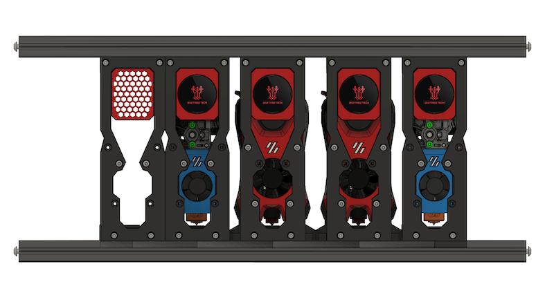
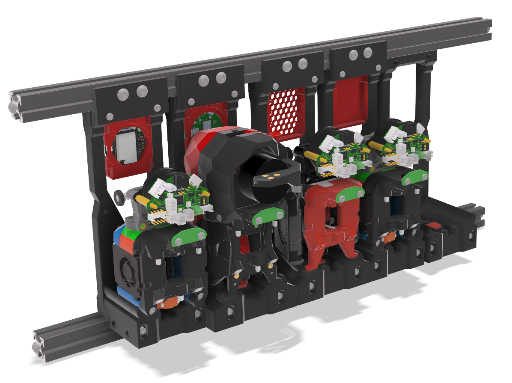

#  Modular Dock

&nbsp;&nbsp;&nbsp;&nbsp;&nbsp;&nbsp;
<a href="https://github.com/sponsors/DraftShift" target="_blank" alt="Sponsor Us">&color=rgb(191%2C%2057%2C%20137))</a>

**Modular Dock for StealthChanger**

This dock is a drop in type. The back plate will allow for you to adjust the tool to be at perfect 90, I'd recommend 1 degree forward just to keep the dock in place.  Magnets are 5x2s and are optional, but recommened.

See [TODO](TODO.md) before you commit to building these.

### Orientation

The STLs are not already in the proper orientation

### Print list
- 1 frame (Top, Bottom, Left, Right)
- 1 frame L bracket (optional)
- 1 [tooltype] Base
- 1 [tooltype] Back [type]
- 1 Wiper [type]
- 1 Container [type] (optional)
- Combination of Links (only if not using crossbar for docks)

**NOTE: all docks must end at on the same `Y` length and `Z` height, do not mix dock lengths or heights**

**NOTE: stubby version not compatible with crossbar versions**

# BOM

[BOM](BOM.md)
