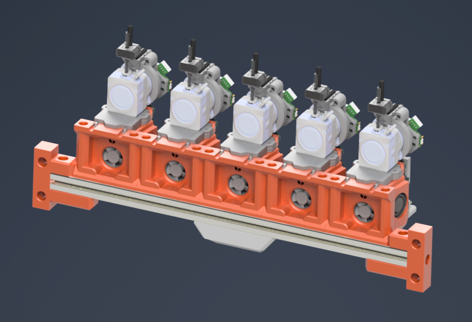
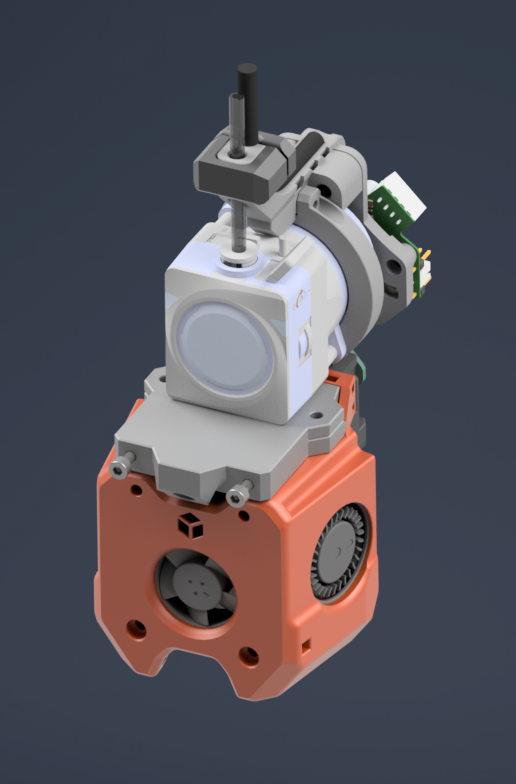
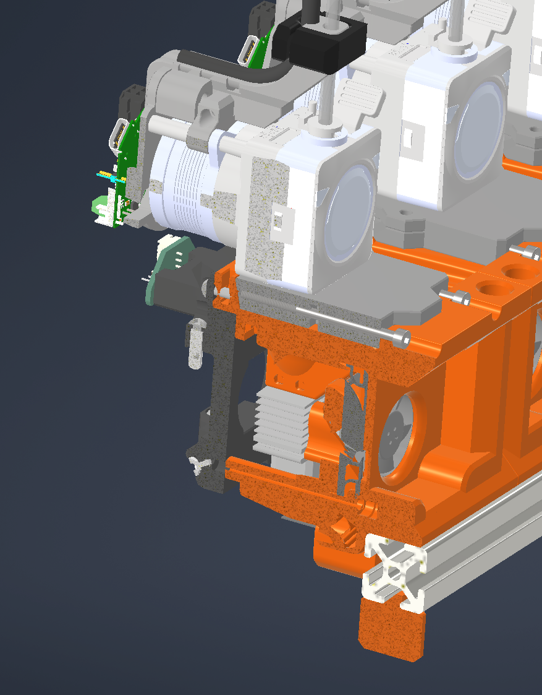
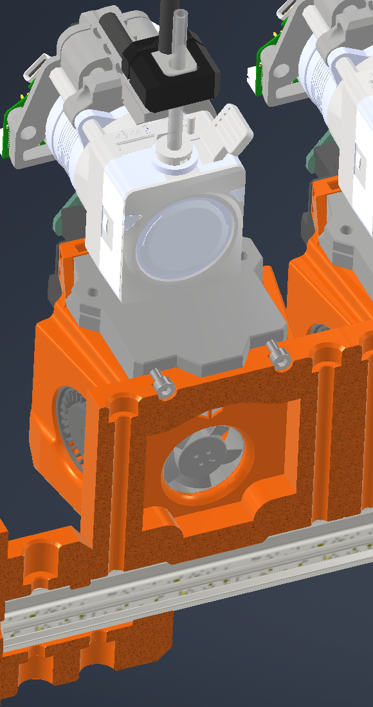

# Docks for A4T with extruder-adapters made for "hanging" the tools in.

They are made like this because I had issues with unstable positioning in modulardocks. Most issues occur due to the form of the fan ducts.

 

The extruder adapters are compatable with Nebula, LGX-lite and hextrudort or extruder with similar mounting pattern.\
Also all Extruder with Sherpa Mini mounting can be used.

## BOM

- M3x50 SHCS (2x per toolhead)
- M5x60 SHCS (2x per toolhead)
- (optional) M3 square nuts 
- 6x3mm magnets
- A4T cowl of choice

## Toolhead fixing

See: https://github.com/Armchair-Heavy-Industries/A4T

This is WIP, will be compatible with crossbow cutter in the future.

## License

This work is licensed under a
[Creative Commons Attribution-NonCommercial-ShareAlike 4.0 International License][cc-by-nc-sa].

[![CC BY-NC-SA 4.0][cc-by-nc-sa-image]][cc-by-nc-sa]

[cc-by-nc-sa]: http://creativecommons.org/licenses/by-nc-sa/4.0/
[cc-by-nc-sa-image]: https://licensebuttons.net/l/by-nc-sa/4.0/88x31.png
[cc-by-nc-sa-shield]: https://img.shields.io/badge/License-CC%20BY--NC--SA%204.0-lightgrey.svg

### License clarification regarding non-commercial use:
The non-commercial aspect of this license is for cases where A4T is the product, not the use of A4T to create products. 
I.e. If you wish to sell A4T as a product, you would need to seek a commercial license before doing so.  
It is NOT intended to prevent the use of A4T in a printer that you use to provide commercial services. If you want to run A4T as a toolhead for your print farm printers, go right ahead.
