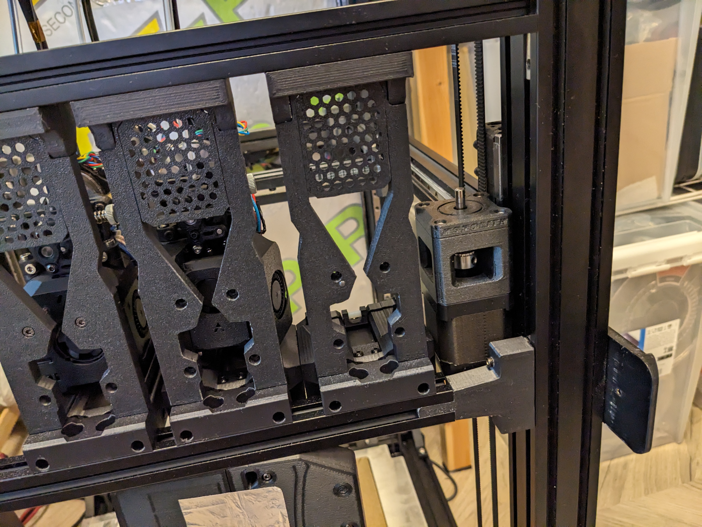
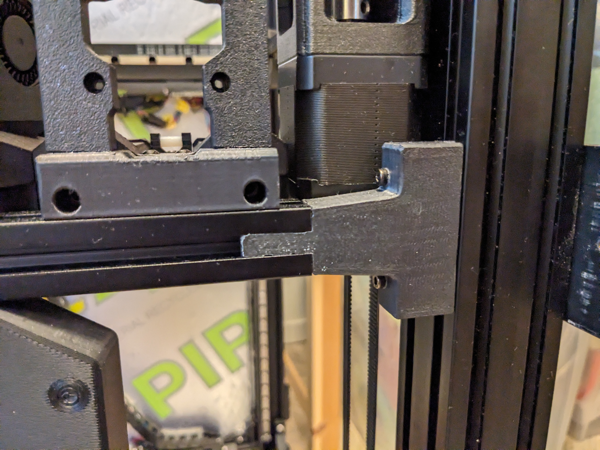

# Monolith_Crossbar
by [MikeYankeeOscarBeta](https://github.com/MikeYankeeOscarBeta/) (VoronDesign Discord: #MikeyMike V2.5796, Voron Toolchangers Discord: MikeyMike - Github: [MikeYankeeOscarBeta](https://github.com/MikeYankeeOscarBeta/StealthChanger))

DraftShiftDesign Discord - user-project thread:    https://discord.com/channels/1226846451028725821/1243948065208008705

### Only compatible with 4040 or 2040 front vertical frame extrusions and R0 Printed Monolith AWD

Printable adapters for crossbar to clear monolith AWD front motors

Have to cut the 2020 to size.
The monolith AWD motors take 45mm on each side so the 2020 has to be 90mm shorter than the normal horizontal extrusions

## BOM:
| Part                        | Amount    | Description                                                                                              |
|-----------------------------|-----------|----------------------------------------------------------------------------------------------------------|
| M3 T-slot nut               | 4         | Any M3 2020 T-Slot Nut will work (recommend springnuts)                                                  |
| M5x20mm SHCS Screw          | 2         | M5 SHCS socket head screw, 20mm minimum (longer is better if you can tap the extrusion deeper than 10mm) |
| M3x25mm SHCS Screw          | 4         | M3 screw, BHCS will also work                                                                            |
| 2020 extrusion              | 1         | 2020 extrusion cut to length (see table below), tapped on both ends. Misumi#: HFS5-2020-380-TPW  / HFSB5-2020-380-TPW                    |
| M3x25mm SHCS Screw          | 4         | M3 screw, BHCS will also work                                                                            |

### Extrusion lengths for Stock V2 sizes:
| Model                 | Calculation           | Monolith AWD Crossbar extrusion length                      |
|-----------------------|-----------------------|-------------------------------------------------------------|
| Voron V2-350          | 470.00 mm - 90mm      | 380 mm                                                      |
| Voron V2-300          | 420 mm - 90mm         | 330 mm                                                      |
| Voron V2-250          | 370 mm - 90mm         | 280 mm                                                      |
| Voron V2-custom size  | [horizontal extrusion length] - 90mm         | x mm                               |

