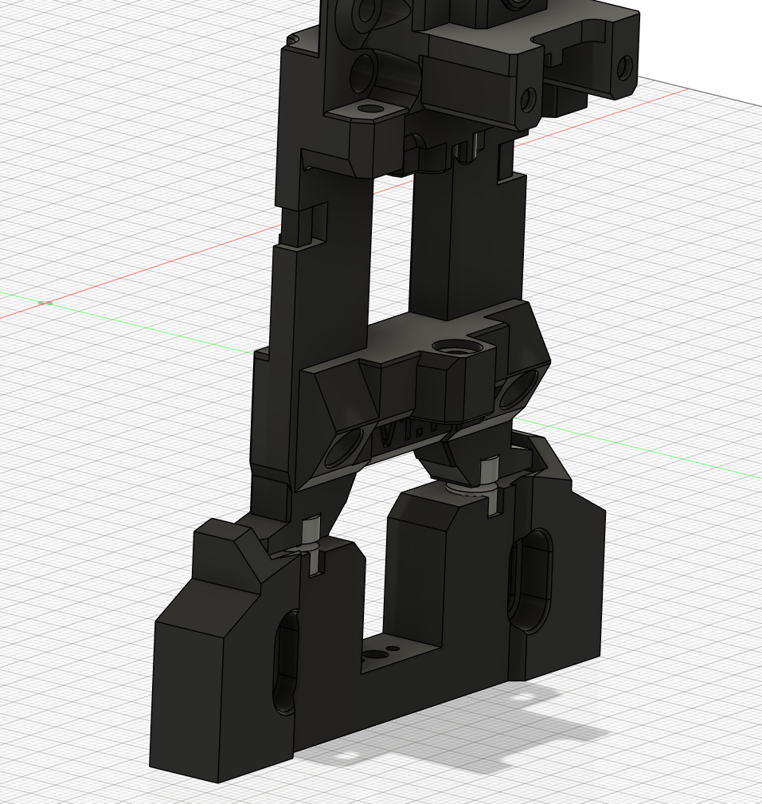
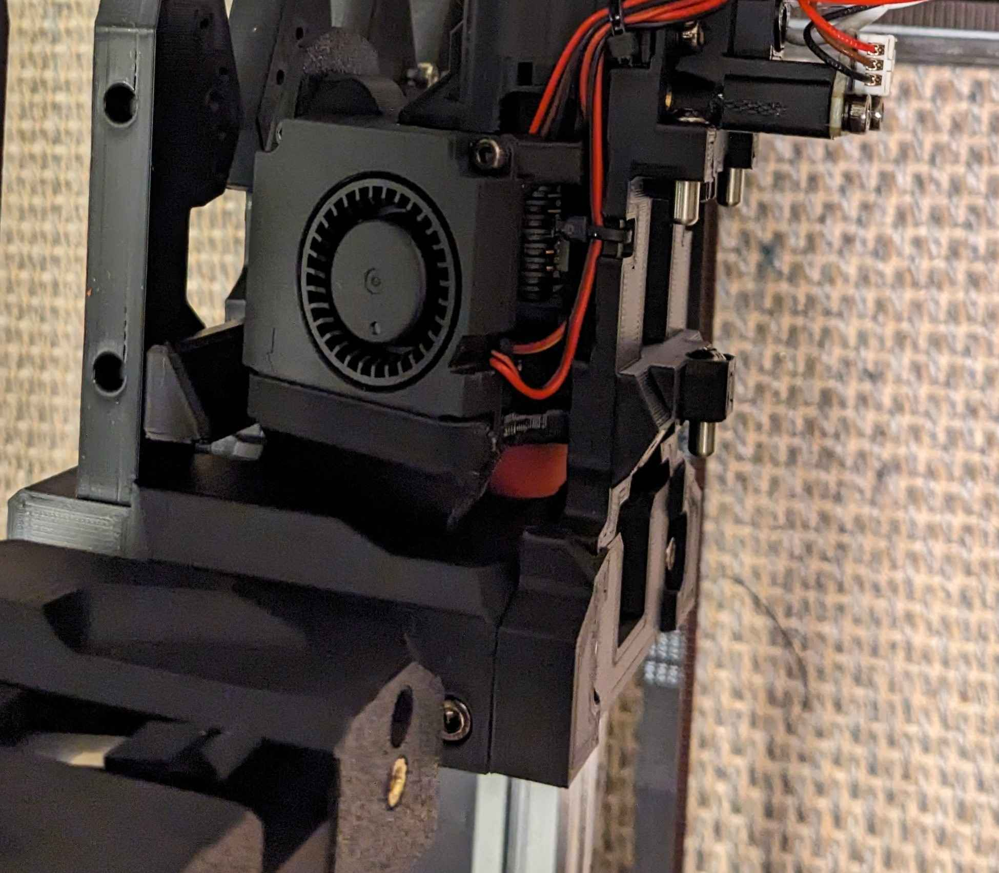

# XOL Magdock Feet
by [MikeYankeeOscarBeta](https://github.com/MikeYankeeOscarBeta/) (DraftShift Discord: #MikeyMike, VoronDesign Discord: #MikeyMike V2.5796, Voron Toolchangers Discord: MikeyMike - Github: [MikeYankeeOscarBeta](https://github.com/MikeYankeeOscarBeta/StealthChanger))

Megnetic dock "feet" for Xol-toolhead StealthChanger and Modular-Docks.
Improves docking/undocking reliability and keeps the toolhead from falling off or moving if you bump or flip the printer.

For further improved docking/undocking combine this mod with the Xol_magdock_adapter mod https://github.com/DraftShift/ModularDock/tree/main/UserMods/MikeYankeeOscarBeta/Xol_magdock_adapter

Individual adapters for NF (normal flow) and UHF (high/ultra high flow) versions of XOL-toolhead.

## Parts to print
### NF (normal flow / "short")
- SC_XOL_nf_Feetmags.stl (replaces stealthchanger XOL_Short.stl) 
- DSD_Modular_Dock_Back_XOL_Feetmags.stl (replaces ModularDock/XOL/Back.stl)
### UHF (ultra high flow / "medium")
- SC_XOL_Feetmags_UHF.stl  (replaces stealthchanger XOL_Medium.stl) 
- DSD_Modular_Dock_Back_XOL_Feetmags.stl (replaces ModularDock/XOL/Back.stl)

## BOM additions:
| Part                           | Amount    | Description                                          | Link |
|--------------------------------|-----------|------------------------------------------------------|-|
| 2x8mm FHCS self-tapping Screw  | 4         | Magnetic 2x8mm Countersunk self-tapping screw (not stainless)     | https://aliexpress.com/item/1005001715736935.html                                                   |
| Countersunk m2 6x3 Magnets    | 4         | Countersunk n52 magnets, but lower strength also works | https://aliexpress.com/item/1005008755692873.html  |

Alternatively you can glue in normal 6x3 magnets with a good high temperature two component epoxy (just make sure the magnets sitting perfectly flush before glueing anything in)