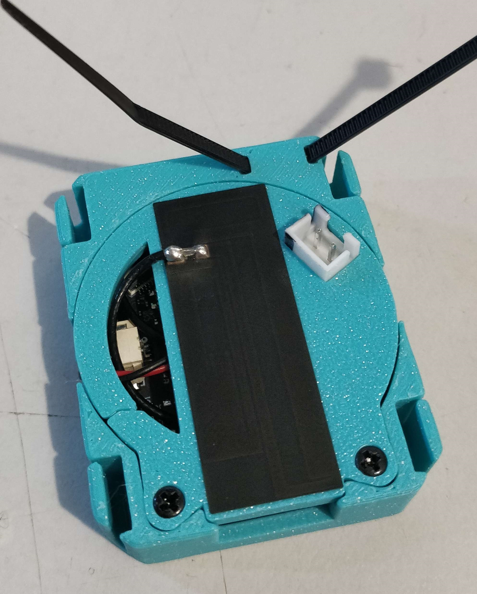

# KNOMI2 Container Mod
Allow the WIFI antenna to be mounted to the back of the container.
Added XH connector.
Added cable tie loop.
Added screws to secure the back plate.
Trimmed sides of frame at extremities of Knomi for cleaner printing.
Added extra clearance around USB port.

#### Extra BOM
2x M2x10mm Self Tapping Screws
1x XH-2A Female Connector
1x Cable Tie

