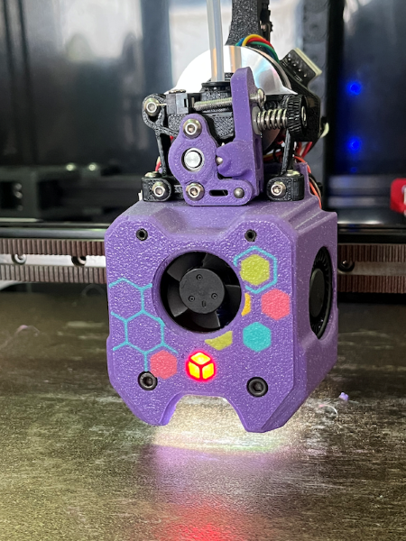
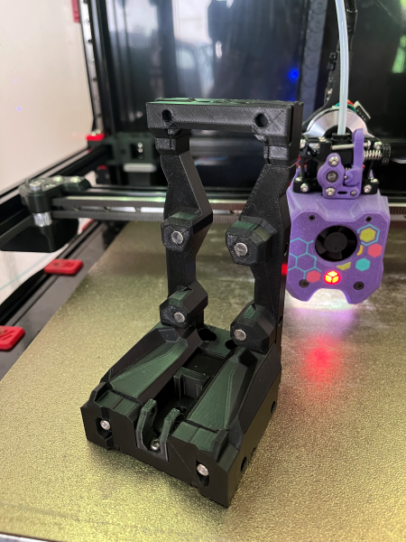
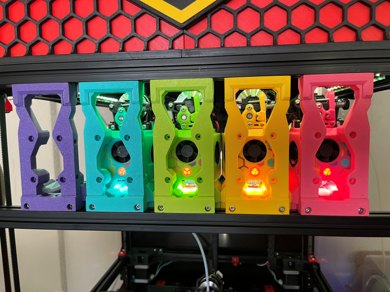

# STEALTHCHANGER A4T MAGNETIC DOCKS

Magnet dock uprights to work with Stealthchanger Modular Docks to allow for the addition of A4T ([A]nother [4]010 [T]oolhead) by [Armchair Heavy Industries](https://github.com/Armchair-Heavy-Industries/A4T).

These dock uprights use 4 6x3mm N52 magnets to allow for 4 magnetic contact points between the dock and the toolhead.

**"But wait!! A4T only has 2 accessible screws on the front face of the toolhead!"** Correct! So I added 2 M3.5mm (yes, M3.5!) grub screws into the upper Allen key access holes to give two more magnetic contact points

## BOM (Per Toolhead)

| Item                                  | QTY | Link (non-affiliate) |
| ------------------------------------- | --- | -------------------- |
| Magnet 6x3mm N52                      |  4  | [Ali Express: HKHK Store](https://www.aliexpress.com/item/1005001542593396.html)
| M3.5 x 8mm grub screw **Magnetic!**   |  2  | [Ali Express: LIYA Hardware](https://www.aliexpress.com/item/32865464785.html)
| M3 x 45mm SHCS **Magnetic**           |  2  | [Ali Express: LIYA Hardware](https://www.aliexpress.com/item/32810872544.html)
| M3 x 12mm SHCS                        |  4  | [Ali Express: LIYA Hardware](https://www.aliexpress.com/item/32810872544.html)

**Note:** If you've already built your A4T toolhead and you used magnetic screws for the main lower mounting screws then you don't need to order extra M3x45mm screws, otherwise you will need the screws from the above BOM.

## ASSEMBLY AND SETUP

1. Assemble your A4T toolhead as per normal, making sure to use the magnetic M3x45mm lower screws to attach the A4T cowl to the Stealthchanger A4T backplate.

2. Check that the upper cowl mounting screws are tight, then thread in the two M3.5mm grub screws, and screw them in until they're flush with the front face of the cowl.

3. Press in 4 6x3mm magnets into the dock uprights. You may need to use superglue to keep them in place.

4. Optional: There are holes to thread in M3x12mm SHCS to allow for some adjustment of the magnet positions. I'm not using any, and my docking movements are smooth, but YMMV.

5. Continue to assemble the docks as per the [Stealthchanger Modular Dock manual](https://github.com/DraftShift/ModularDock/tree/main/Manual).

6. Set your dock park positions as you normally would as per the [Stealthchanger wiki](https://github.com/DraftShift/StealthChanger/blob/main/wiki/Calibration.md)

Modular Dock with A4T magnetic uprights:

## FAQ
- **What Stealthchanger dock system does this work with?** This is compatible with Stealthchanger Modular Docks
- **Does this suit the long or short dock option?** At this point I've only been working with the short docks on my build, I've got no intention of making this work for the long dock system unless people ask for it.

## CREDITS

Credit goes to the hard work by the people at DraftShift Design for their work on the Stealthchanger Voron toolchanger project, and DW-Tas at Armchair Heavy Industries for all the work on A4T!.

[DraftShift Design](https://github.com/DraftShift)

[Armchair Heavy Industries](https://github.com/Armchair-Heavy-Industries)