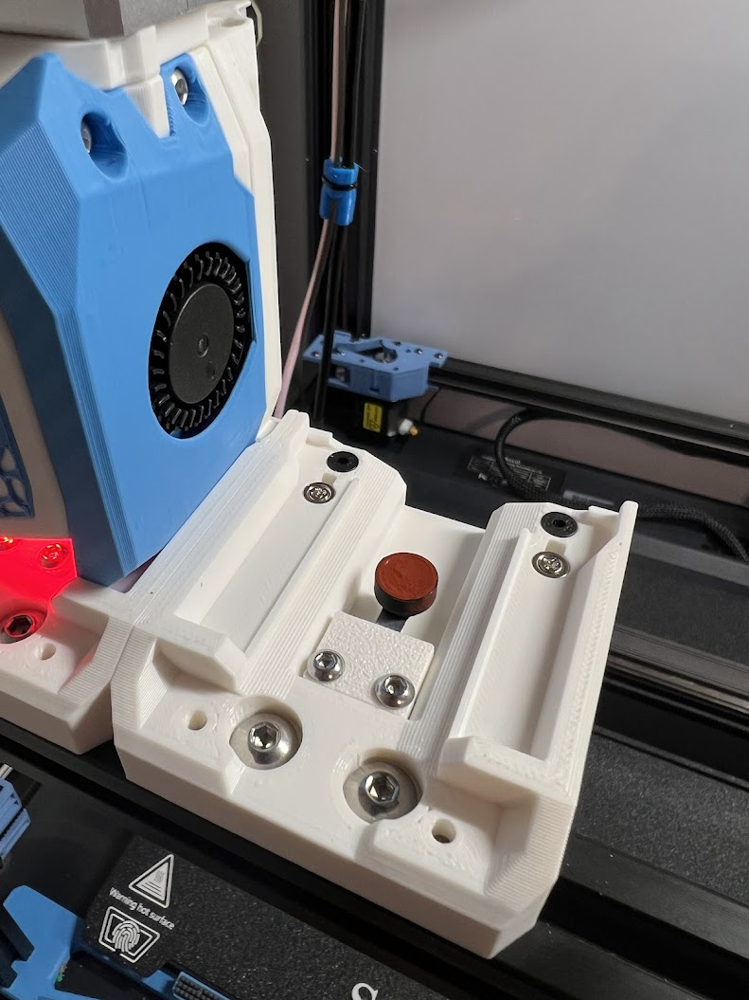

# Spring Cup Blocker

by [jwellman80](https://github.com/jwellman80) aka. averen on most of the Discords. 

This blocker is held up by a short piece of spring steel rather than a spring.  I found that 22mm measured from the center screw was just about right for use with the AntHead docks.  

# BOM

|Part|Amount|Description|
|:---|:----:|:----------|
|Spring Steel| 1 | [Amazon](https://www.amazon.com/SunplusTrade-Stainless-Exhaust-Multi-Purpose-Locking/dp/B072WC1MXT) |
|M2x4 Screw| 1 | [Amazon](https://www.amazon.com/dp/B0C5JVC6Z3)|

The Spring Steel and Screws can likely be anything that fits.  Above is just what I used.  

# Instructions

- Cut a piece of spring steel longer than you need (makes a nice handle when filling with Silicone)
- Drill a hole through the spring steel that the screw will pass through
- Attach the spring steel to the printed part with the screw
- Fill with High Temp RTV Silicone
- Let cure 
- Mount using the [Spring Steel Body and Spring Steel Clamp](https://github.com/DraftShift/ModularDock/tree/main/STLs/Blockers) that corresponds to your docks. 

